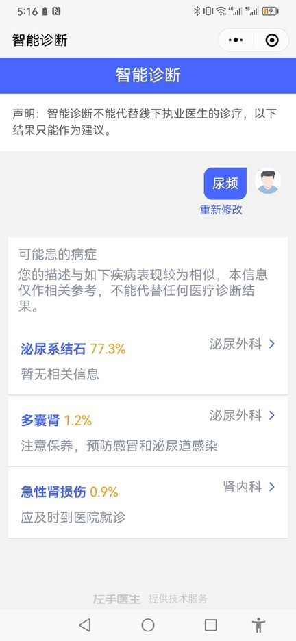

## Demo项目主要思路

### 1. 数据集预处理（data_process.py）

#### 1.1 去除原数据第4、5列多余的换行

#### 1.2 去除列名，为每个字段在旁边加上它的标签，储存为txt文件，字段间改为用';'隔开

### 2. LangChain框架（doctor_rec.py）

#### 2.1 选用text2vec3作为embedding模型，将doctor_info_clear.txt分为块，并且向量化，储存到向量数据库中。

#### 2.2 和用户交互开始时，需要先询问用户信息，参考（小程序：智能导诊）

#### 2.3 设置提示词，系统提示词设定角色和主要任务，普通提示词设定任务细节信息。

#### 2.4 将用户输入的问题输入数据库，做相似度检索，获取相关性最大的医生信息。（这里需要做很多优化）

#### 2.5 将<用户信息>、<用户提问>、<系统提示词>、<普通提示词>、<检索得到的医生信息>拼接到一起，得到完整的提示词

### 3. 模型调优（ChatGLM2-6B-main/ptuning，参考：[ChatGLM2](https://github.com/THUDM/ChatGLM2-6B)）

#### 3.1 由于机器原因，只能使用ChatGLM-6B-int4模型，效果不理想，模型不能输出连贯语句。但在ChatGPT平台测试结果相对较好。因此考虑用ChatGPT生成虚拟数据集，对ChatGLM进行少量Epoch微调，目的是让ChatGLM-6B-int4能够学会根据信息生成连贯句子，同时防止过拟合。

#### 3.2 生成的数据集采用问答对的形式，让ChatGPT生成问题，再让ChatGPT回答问题，记录问答结果。

#### 3.3 生成问题的提示词: [ptuning/knowledge/prompt.txt](https://github.com/524130120/ChatGLM2-demo/tree/main/ChatGLM2-6B-main/ptuning/knowledge/prompt.txt) --> '生成问题'； 生成问答对的提示词：[ptuning/knowledge/prompt.txt](https://github.com/524130120/ChatGLM2-demo/tree/main/ChatGLM2-6B-main/ptuning/knowledge/prompt.txt) --> '生成回答'

#### 3.4 生成的数据集：[ptuning/knowledge/train.json](https://github.com/524130120/ChatGLM2-demo/tree/main/ChatGLM2-6B-main/ptuning/knowledge/train.json), [ptuning/knowledge/dev.json](https://github.com/524130120/ChatGLM2-demo/tree/main/ChatGLM2-6B-main/ptuning/knowledge/dev.json)；总共40个样本

#### 3.5 微调600个epoch，每100个epoch记录结果。实验发现100个epoch效果较好，更大的epoch会发生过拟合。

微调epoch为100时的对话结果
